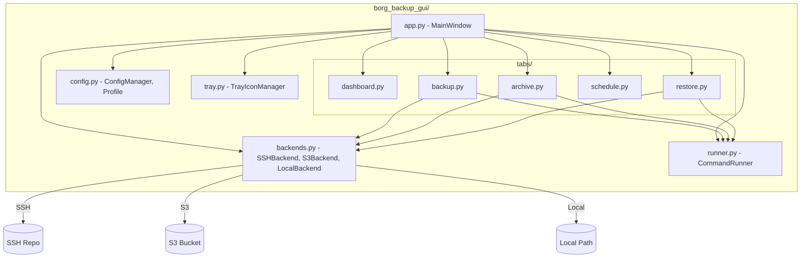
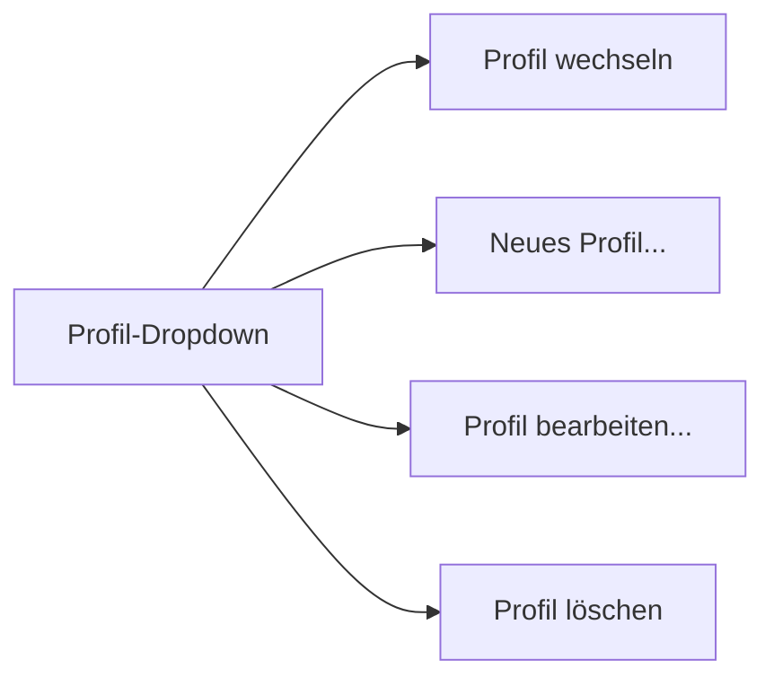
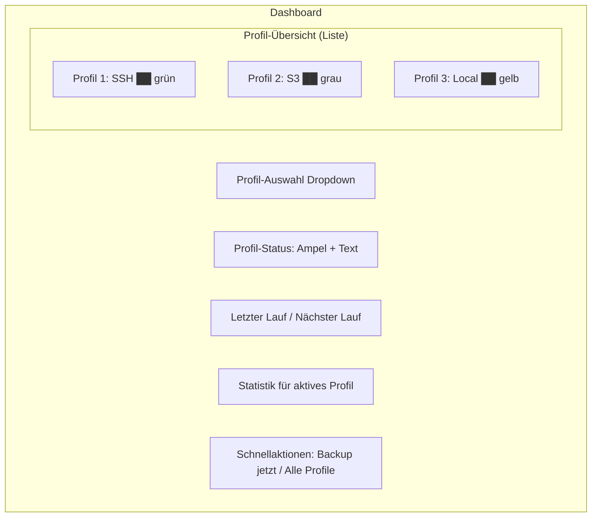

# Borg Backup GUI - Technischer Umbau- und Erweiterungsplan

## Ziel
Umbau der bestehenden `Hetzner Borg GUI` (monolithische 2411-Zeilen-Tkinter-App) zu einer modularen, profil-basierten Backup-GUI mit Unterstützung für lokale, SSH- und S3-Backends.

---

## Architektur-Übersicht (Zielzustand)



---

## Phase 1: Umbenennung + Modularisierung (Fundament)

### 1.1 Neue Verzeichnisstruktur

```
Hetzner_Backup_and_Restore/           (Projekt-Root, bleibt bestehen)
├── borg_backup_gui.py                → NEU: Entry-Point (ersetzt hetzner_borg_gui.py)
├── borg_backup_gui/                  → NEU: Modul-Paket
│   ├── __init__.py
│   ├── __main__.py                   → `python -m borg_backup_gui`
│   ├── app.py                        → MainWindow (Tk root, Notebook, Shared State)
│   ├── config.py                     → ConfigManager, Profile, Status
│   ├── backends.py                   → BackendBase, SSHBackend, S3Backend, LocalBackend
│   ├── runner.py                     → CommandRunner (aus bestehendem Code extrahiert)
│   ├── tray.py                       → TrayIconManager (aus bestehendem Code extrahiert)
│   ├── tabs/
│   │   ├── __init__.py
│   │   ├── dashboard.py              → Start/Dashboard Tab
│   │   ├── backup.py                 → Backup Tab + Backup-Logik
│   │   ├── archive.py                → Archiv & Restore Tab
│   │   ├── schedule.py               → Zeitplan & Wartung Tab
│   │   └── restore.py                → Restore Tab
│   └── assets/
│       └── borg-backup-gui.svg       → Umbenannt von hetzner-borg-gui.svg
├── assets/
│   └── borg-backup-gui.svg           → Neue Kopie/umbenannt
├── borg-backup-gui.desktop           → Umbenannt
├── start_gui.sh                      → Aktualisiert
├── install_desktop_launcher.sh       → Aktualisiert
├── install_nopasswd_rule.sh          → Aktualisiert
├── restore.sh                        → Unverändert (eigenständig)
└── requirements.txt                  → Unverändert
```

### 1.2 Umbenennungs-Mapping

| Alt | Neu |
|-----|-----|
| `hetzner_borg_gui.py` | `borg_backup_gui.py` (Entry) + `borg_backup_gui/` (Paket) |
| `HetznerBorgGUI` (Klasse) | `MainWindow` in `app.py` |
| `'Hetzner Borg GUI'` (Titel) | `'Borg Backup GUI'` |
| `'HetznerBorgGUI'` (WM_CLASS) | `'BorgBackupGUI'` |
| `~/.config/hetzner-borg-gui/` | `~/.config/borg-backup-gui/` |
| `hetzner-borg-gui.svg` | `borg-backup-gui.svg` |
| `hetzner-borg-gui.desktop` | `borg-backup-gui.desktop` |
| `hetzner_borg_gui` (Tray-ID) | `borg_backup_gui` |

### 1.3 Konfigurations-Migration

**Altes Format** (`~/.config/hetzner-borg-gui/config.json`):
```json
{
    "storage": "uXXXXXX@uXXXXXX.your-storagebox.de:./backup",
    "ssh_key": "/home/user/.ssh/id_ed25519",
    "include_folders": ["/"],
    "exclude_folders": [...],
    "compression": "lz4",
    "encryption": "repokey",
    "borg_passphrase": "",
    "schedule_type": "daily",
    "schedule_interval": 3,
    "schedule_time": "03:15",
    "catchup_missed": true,
    "prune_enabled": false,
    "validate_enabled": true,
    "validate_interval": 3,
    "optimize_enabled": false,
    "optimize_interval": 3,
    "promptless_privilege": true,
    "tray_enabled": true,
    "tray_icon_style": "disk",
    "privilege_mode": "auto"
}
```

**Neues Format** (`~/.config/borg-backup-gui/config.json`):
```json
{
    "version": 2,
    "global": {
        "tray_enabled": true,
        "tray_icon_style": "disk",
        "promptless_privilege": true,
        "active_profile": null
    },
    "profiles": [
        {
            "name": "Standard",
            "type": "ssh",
            "storage": "uXXXXXX@uXXXXXX.your-storagebox.de:./backup",
            "ssh_key": "/home/user/.ssh/id_ed25519",
            "passphrase": "",
            "compression": "lz4",
            "encryption": "repokey",
            "include_folders": ["/"],
            "exclude_folders": [...],
            "schedule_type": "daily",
            "schedule_interval": 3,
            "schedule_time": "03:15",
            "catchup_missed": true,
            "prune_enabled": false,
            "validate_enabled": true,
            "validate_interval": 3,
            "optimize_enabled": false,
            "optimize_interval": 3,
            "enabled": true
        }
    ]
}
```

**Migrations-Logik:**
1. Beim Start prüfen: existiert `~/.config/hetzner-borg-gui/config.json` aber nicht `~/.config/borg-backup-gui/config.json`?
2. Alte Config einlesen, in neues Format konvertieren (ein Profil "Standard" vom Typ "ssh")
3. Alten Status einlesen und dem Profil zuweisen
4. Neue Config schreiben
5. Alte Dateien **nicht löschen** (User kann manuell aufräumen)

### 1.4 Modul-Aufteilung

#### `borg_backup_gui/__init__.py`
- Leer oder Package-Metadaten

#### `borg_backup_gui/__main__.py`
```python
from borg_backup_gui.app import main
raise SystemExit(main())
```

#### `borg_backup_gui/config.py` – ConfigManager
```python
class Profile:
    """Ein Backup-Profil mit allen Einstellungen."""
    name: str
    type: str              # 'ssh', 's3', 'local'
    storage: str           # Repo-URL oder Pfad
    # SSH-spezifisch
    ssh_key: str
    # S3-spezifisch
    s3_access_key: str
    s3_secret_key: str
    s3_endpoint_url: str   # für Hetzner Object Storage
    s3_region: str
    # Gemeinsam
    passphrase: str
    compression: str
    encryption: str
    include_folders: list
    exclude_folders: list
    # Zeitplan
    schedule_type: str     # 'manual', 'daily', 'interval'
    schedule_interval: int
    schedule_time: str
    catchup_missed: bool
    # Wartung
    prune_enabled: bool
    validate_enabled: bool
    validate_interval: int
    optimize_enabled: bool
    optimize_interval: int
    # Status
    enabled: bool
    status: ProfileStatus

class ProfileStatus:
    """Laufzeit-Status eines Profils."""
    last_run_at: str
    last_success_at: str
    last_exit_code: int
    last_error: str
    last_duration_sec: float
    last_files_count: int
    last_source_size: str
    last_dedupe_size: str
    last_item: str
    last_check_at: str
    last_compact_at: str

class ConfigManager:
    """Lädt/speichert die gesamte Konfiguration."""
    def load(self) -> dict
    def save(self)
    def migrate_from_v1(self, old_config_path: Path) -> bool
    def get_active_profile(self) -> Profile | None
    def get_profiles(self) -> list[Profile]
    def add_profile(self, profile: Profile)
    def remove_profile(self, name: str)
    def get_profile_status(self, name: str) -> ProfileStatus
```

#### `borg_backup_gui/backends.py` – Backend-Abstraktion

```python
class BackendBase(ABC):
    """Abstrakte Basis für alle Backend-Typen."""
    @abstractmethod
    def get_env(self, profile: Profile) -> dict:
        """Liefert die Umgebungsvariablen für Borg-Befehle."""
    
    @abstractmethod
    def get_repo_url(self, profile: Profile) -> str:
        """Liefert die bereinigte Repository-URL."""
    
    @abstractmethod
    def get_label(self) -> str:
        """Anzeigename des Backends."""
    
    def needs_root_for_create(self) -> bool:
        """Ob 'borg create' root-Rechte braucht."""
        return True  # Default für System-Backups

class SSHBackend(BackendBase):
    """SSH-basiertes Backend (Hetzner Storage Box, beliebiger SSH-Server)."""
    def get_env(self, profile):
        # Setzt BORG_RSH mit ssh -p 23, StrictHostKeyChecking, etc.
        # BORG_RELOCATED_REPO_ACCESS_IS_OK=yes
        # BORG_CACHE_DIR
    
    def get_repo_url(self, profile):
        # Korrigiert Port 23 im Pfad, etc.
    
    def get_label(self):
        return "SSH / Storage Box"

class S3Backend(BackendBase):
    """S3-kompatibles Backend (Hetzner Object Storage, AWS S3, MinIO, ...)."""
    def get_env(self, profile):
        # AWS_ACCESS_KEY_ID, AWS_SECRET_ACCESS_KEY
        # AWS_ENDPOINT_URL (für Hetzner: https://fsn1.your-objectstorage.com)
        # KEIN BORG_RSH
    
    def get_repo_url(self, profile):
        # s3://bucket-name
    
    def get_label(self):
        return "S3 Object Storage"

class LocalBackend(BackendBase):
    """Lokales Dateisystem-Backend."""
    def get_env(self, profile):
        # Keine speziellen Env-Vars nötig
        # Nur BORG_CACHE_DIR, BORG_PASSPHRASE
    
    def get_repo_url(self, profile):
        # /mnt/backup_disk/borg-repo (direkter Pfad)
    
    def get_label(self):
        return "Lokales Laufwerk"
```

#### `borg_backup_gui/runner.py` – CommandRunner
- 1:1 aus bestehendem Code extrahiert
- `run()` – Live-Output
- `run_capture()` – Captured Output
- `stop()`

#### `borg_backup_gui/tray.py` – TrayIconManager
- Komplette Tray-Logik aus `HetznerBorgGUI` extrahiert
- Bekommt `app`-Referenz für Callbacks
- `start()`, `stop()`, `update_status(color, title)`
- `_build_tray_icon_image()`, `_compute_status_traffic_light()`

#### `borg_backup_gui/app.py` – MainWindow

```python
class MainWindow:
    """Hauptfenster - erstellt Tk root, Notebook, initialisiert alle Tabs."""
    def __init__(self):
        self.root = tk.Tk()
        self.config = ConfigManager()
        self.runner = CommandRunner(...)
        self.tray = TrayIconManager(self)
        
        self.notebook = ttk.Notebook(...)
        
        # Tabs als eigenständige Klassen
        self.tab_dashboard = DashboardTab(self.notebook, self)
        self.tab_backup = BackupTab(self.notebook, self)
        self.tab_archive = ArchiveTab(self.notebook, self)
        self.tab_schedule = ScheduleTab(self.notebook, self)
        self.tab_restore = RestoreTab(self.notebook, self)
        
        # Globale State (profil-übergreifend)
        self.backup_running = False
        self.current_profile = None
        # ...
```

#### Tab-Klassen (Pattern für alle Tabs)

```python
class DashboardTab:
    """Start/Dashboard Tab."""
    def __init__(self, notebook, app):
        self.app = app
        self.frame = ttk.Frame(notebook)
        notebook.add(self.frame, text='Start')
        self._build_ui()
    
    def _build_ui(self):
        # Profil-Auswahl Dropdown
        # Status-Anzeige für aktives Profil
        # Schnellaktionen
        # ...
    
    def refresh(self):
        # Status aktualisieren
```

---

## Phase 2: Mount-Verbesserung + Archivlisten-Caching

### 2.1 Mount-Verbesserung

**Aktueller Stand** ([`hetzner_borg_gui.py:2327-2355`](hetzner_borg_gui.py:2327)):
- Mount nach `/tmp/borg-mount` (hartkodiert)
- Kein Unmount
- Nur MessageBox

**Ziel-Zustand:**

```python
class ArchiveTab:
    def __init__(self, notebook, app):
        # ...
        self.mount_active = False
        self.mount_point = Path('/tmp/borg-mount')
        self.mount_button = None    # toggled zwischen "Mounten" / "Unmounten"
        self.open_button = None     # "In Dateien öffnen"
    
    def _mount_archive(self):
        # Mount ausführen
        # Button-Labels umschalten
        # self.mount_active = True
    
    def _unmount_archive(self):
        # borg umount /tmp/borg-mount
        # Button-Labels zurücksetzen
        # self.mount_active = False
    
    def _open_mount_in_filemanager(self):
        # xdg-open /tmp/borg-mount (Linux)
        # open /tmp/borg-mount (macOS)
        # explorer /tmp/borg-mount (Windows - unwahrscheinlich)
    
    def _cleanup_mount(self):
        # Beim Tab-Wechsel oder App-Ende: unmounten
```

**GUI-Änderung:**
```
[Archivliste laden]  [Mounten/Unmounten]  [In Dateien öffnen]  [Löschen]
                                                ^-- disabled wenn nicht gemountet
```

### 2.2 Archivlisten-Caching

**Aktueller Stand:**
- `_load_archive_list()` ([Zeile 2206](hetzner_borg_gui.py:2206)) lädt jedes Mal neu vom Server
- `archive_list_refresh_pending` ([Zeile 2202](hetzner_borg_gui.py:2202)) nur bedingt aktiv

**Ziel-Zustand:**

```python
class ArchiveTab:
    def __init__(self, notebook, app):
        self.cached_archives = {}     # {profile_name: [archive_entries]}
        self.cache_timestamp = {}     # {profile_name: datetime}
        self.cache_valid_seconds = 300  # 5 Minuten
    
    def show(self):
        """Wird aufgerufen, wenn der Tab sichtbar wird."""
        profile = self.app.config.get_active_profile()
        if self._is_cache_valid(profile.name):
            self._display_from_cache(profile.name)
        else:
            self._load_archive_list()  # Lädt und updated Cache
    
    def _is_cache_valid(self, profile_name):
        if profile_name not in self.cached_archives:
            return False
        age = (datetime.now() - self.cache_timestamp[profile_name]).total_seconds()
        return age < self.cache_valid_seconds
    
    def _refresh_in_background(self):
        """Leiser Refresh im Hintergrund ohne UI-Blockade."""
        # Wird nach Backup-Ende und periodisch aufgerufen
        # Updated self.cached_archives
        # Wenn Tab gerade sichtbar: Treeview aktualisieren
```

**Trigger für Auto-Refresh:**
1. Nach jedem Backup (`_backup_done`) → `archive_tab.request_background_refresh()`
2. Beim ersten Öffnen des Tabs (wenn Cache alt)
3. Periodisch alle 5 Minuten (nur wenn Tab sichtbar)

**`_backup_done`-Erweiterung** ([Zeile 2157](hetzner_borg_gui.py:2157)):
```python
def _backup_done(self, result):
    # ... bestehende Logik ...
    
    # Archiv-Cache invalidieren und Refresh triggern
    self.tab_archive.invalidate_cache(self.current_profile.name)
    self.tab_archive.request_background_refresh()
```

---

## Phase 3: Multi-Profil-System + S3

### 3.1 Profil-Verwaltung GUI

**Neuer Tab oder Dropdown im Header:**



**Profil-Erstellungs-Dialog (Modal):**
```
┌──────────────────────────────────────────┐
│  Neues Backup-Profil                     │
│                                          │
│  Name: [___________________________]     │
│                                          │
│  Typ:  ○ SSH / Storage Box               │
│        ○ S3 Object Storage               │
│        ○ Lokales Laufwerk                │
│                                          │
│  ── SSH-Einstellungen ──                │
│  Repository-URL: [________________]      │
│  SSH-Key: [________________] [Wählen]    │
│  Passphrase: [________________]          │
│                                          │
│  ── S3-Einstellungen ──                 │
│  Bucket-Name: [________________]         │
│  Access Key: [________________]          │
│  Secret Key: [________________]          │
│  Endpoint URL: [________________]        │
│  Region: [________________]              │
│                                          │
│  ── Lokale Einstellungen ──             │
│  Repository-Pfad: [________________]     │
│                                    [Wählen]│
│                                          │
│  ☑ Profil aktivieren                    │
│                                          │
│            [Abbrechen]  [Erstellen]      │
└──────────────────────────────────────────┘
```

### 3.2 S3-Backend-Implementierung

**Borg S3-Integration (nativ, kein zusätzlicher Code nötig):**

Borg unterstützt S3 nativ. Die Repo-URL ist:
```
s3://bucket-name
```

Für Hetzner Object Storage (nicht-AWS S3) braucht man:
```bash
export AWS_ACCESS_KEY_ID=your_key
export AWS_SECRET_ACCESS_KEY=your_secret
export AWS_ENDPOINT_URL=https://fsn1.your-objectstorage.com
borg create s3://my-bucket::archive-name /path/to/backup
```

**Backend-Implementierung:**

```python
class S3Backend(BackendBase):
    def get_env(self, profile: Profile) -> dict:
        env = os.environ.copy()
        env['AWS_ACCESS_KEY_ID'] = profile.s3_access_key
        env['AWS_SECRET_ACCESS_KEY'] = profile.s3_secret_key
        if profile.s3_endpoint_url:
            env['AWS_ENDPOINT_URL'] = profile.s3_endpoint_url
        if profile.s3_region:
            env['AWS_DEFAULT_REGION'] = profile.s3_region
        # Borg-Passphrase
        if profile.passphrase:
            env['BORG_PASSPHRASE'] = profile.passphrase
        # Cache
        env['BORG_CACHE_DIR'] = os.path.expanduser('~/.cache/borg')
        # KEIN BORG_RSH!
        return env
    
    def get_repo_url(self, profile: Profile) -> str:
        return f"s3://{profile.storage}"
    
    def needs_root_for_create(self) -> bool:
        return True  # System-Backups brauchen root
```

**Wichtig:** `_borg_env()` im SSHBackend setzt `BORG_RSH` – das darf bei S3 **nicht** gesetzt werden.

### 3.3 Zeitplan pro Profil

Jedes Profil hat seinen eigenen Zeitplan. Der `MainWindow` managed eine Map von Timer-IDs pro Profil:

```python
class MainWindow:
    def __init__(self):
        self.profile_timers = {}  # {profile_name: after_id}
    
    def _schedule_profile(self, profile: Profile):
        # Bestehenden Timer für dieses Profil canceln
        if profile.name in self.profile_timers:
            self.root.after_cancel(self.profile_timers[profile.name])
        
        if profile.schedule_type == 'manual' or not profile.enabled:
            self.profile_timers[profile.name] = None
            return
        
        # Nächsten Zeitpunkt berechnen (bestehende Logik)
        next_dt = self._calculate_next_run(profile)
        delay_ms = int((next_dt - datetime.now()).total_seconds() * 1000)
        
        self.profile_timers[profile.name] = self.root.after(
            max(delay_ms, 1000),
            lambda p=profile: self._start_scheduled_backup(p)
        )
    
    def reschedule_all(self):
        for profile in self.config.get_profiles():
            self._schedule_profile(profile)
```

### 3.4 Dashboard für Multi-Profil



**Dashboard zeigt:**
- Dropdown: aktives Profil wählen
- Ampel + Status für aktives Profil
- Mini-Liste aller Profile mit Status-Farbpunkt
- "Backup jetzt" → startet für aktives Profil
- "Alle aktiven Profile sichern" → startet sequentiell

### 3.5 "Dual"-Modus

Kein separater Modus, sondern ergibt sich aus dem Profil-System:
- User erstellt Profil "Lokale Platte" (Typ: local)
- User erstellt Profil "Hetzner Cloud" (Typ: ssh oder s3)
- Beide haben `schedule_type: daily, schedule_time: 03:00`
- → Beide laufen nacheinander (um 03:00 und 03:00 + Backup-Dauer)

**Optional: "Dual"-Preset als Quick-Setup:**
- Button "Dual-Backup einrichten..."
- Erstellt zwei Profile (lokal + cloud) mit einem Wizard
- Fragt beide Ziele ab, kopiert Include/Exclude

---

## Phase 4: GUI-Feinschliff

### 4.1 Tab-Redesign (Backup-Tab)

**Aktuell:** Ein Formular für ein Repository.

**Neu:** 
- Profil-Auswahl oben
- Darunter die profil-spezifischen Felder
- Felder ändern sich je nach Backend-Typ (SSH/S3/Local)

```
┌─────────────────────────────────────────────────┐
│ Profil: [Hetzner Storage Box ▼] [Neu] [Edit] [✕]│
├─────────────────────────────────────────────────┤
│ Typ: SSH / Storage Box                          │
│                                                  │
│ Repository URL: [___________________________]    │
│ SSH Key: [___________________________] [Wählen]  │
│ Passphrase: [___________________________]        │
│ Kompression: [lz4 ▼]                            │
│                                                  │
│ Include:                    Exclude:             │
│ [________________]          [________________]   │
│ [________________]          [________________]   │
│                                                  │
│ [Backup jetzt] [Abbrechen]                      │
└─────────────────────────────────────────────────┘
```

### 4.2 Tab-Redesign (Zeitplan-Tab)

Zeitplan wird pro Profil konfiguriert:

```
┌─────────────────────────────────────────────────┐
│ Profil: [Hetzner Storage Box ▼]                 │
├─────────────────────────────────────────────────┤
│ Backup-Zeitplan                                 │
│  ○ Nur manuell                                  │
│  ○ Regelmäßig: [_3_] Stunden                   │
│  ● Täglich: [_03:15_] Uhr                      │
│  ☑ Verpasste Backups nachholen                  │
│                                                  │
│ Wartung                                         │
│  ☐ Ausdünnen (Prune)                           │
│  ☑ Validierung: alle [_3_] Wochen               │
│  ☐ Optimierung: alle [_3_] Wochen               │
│                                                  │
│ [Für dieses Profil speichern]                   │
└─────────────────────────────────────────────────┘
```

---

## Implementierungs-Reihenfolge

### Schritt 1: Umbenennung + Config-Migration
- [ ] Alle Dateien umbenennen (Klassen, Variablen, Pfade, Strings)
- [ ] `ConfigManager` mit Migrationslogik bauen
- [ ] Test: App startet mit alter Config, migriert automatisch

### Schritt 2: Code in Module aufteilen
- [ ] `runner.py` extrahieren
- [ ] `config.py` extrahieren
- [ ] `tray.py` extrahieren
- [ ] `app.py` als MainWindow
- [ ] `tabs/dashboard.py`, `tabs/backup.py`, etc.
- [ ] Test: Alle bestehenden Funktionen laufen wie vorher

### Schritt 3: Mount-Verbesserung
- [ ] Unmount-Funktion
- [ ] "In Dateien öffnen"-Button
- [ ] Cleanup bei App-Ende
- [ ] Test: Mount/Unmount/Open funktioniert

### Schritt 4: Archivlisten-Caching
- [ ] Cache-Datenstruktur in `ArchiveTab`
- [ ] Hintergrund-Refresh nach Backup
- [ ] Periodischer Refresh
- [ ] Sofortige Anzeige aus Cache beim Tab-Wechsel
- [ ] Test: Archivliste erscheint sofort nach Backup

### Schritt 5: Backend-Abstraktion
- [ ] `BackendBase`, `SSHBackend`, `S3Backend`, `LocalBackend`
- [ ] `_borg_env()` und `_borg_repo()` durch Backend ersetzen
- [ ] Test: SSH-Backup funktioniert wie vorher

### Schritt 6: Profil-System
- [ ] `Profile` Datenklasse
- [ ] Profil-Erstellungs-Dialog
- [ ] Profil-Auswahl in GUI
- [ ] Per-Profil-Konfiguration (Backup-Tab, Zeitplan-Tab)
- [ ] Per-Profil-Status
- [ ] Test: Mehrere Profile erstellen, wechseln, Backups ausführen

### Schritt 7: S3-Backend
- [ ] S3-Konfiguration in Profil-Dialog
- [ ] S3-Backend-Implementierung
- [ ] Test: Backup auf Hetzner Object Storage

### Schritt 8: Multi-Profil-Dashboard + Zeitpläne
- [ ] Profil-Liste im Dashboard
- [ ] "Alle Profile sichern"-Button
- [ ] Pro-Profil-Zeitplan
- [ ] Test: Zwei Profile mit Zeitplan laufen automatisch

---

## Risiken & Fallstricke

1. **sudo/NOPASSWD mit S3:** Borg S3-Backups brauchen ggf. root für Dateizugriff. Die bestehende NOPASSWD-Regel müsste für S3-Umgebungsvariablen erweitert werden (`env_keep` um AWS_* ergänzen).

2. **Config-Migration:** Wenn die Migration fehlschlägt, muss die alte Config erhalten bleiben. Niemals automatisch löschen.

3. **Tray-Icon unter KDE/GNOME/XFCE:** Die Tray-Implementierung ist komplex (Ayatana + pystray-Fallback). Beim Refactoring muss die genaue Funktionalität erhalten bleiben.

4. **Borg-Repo-Typen:** SSH-Repos und S3-Repos sind fundamental anders. Ein `borg list` auf ein S3-Repo funktioniert mit anderen Env-Vars als auf SSH. Das Backend-System muss das korrekt abbilden.

5. **Parallele Backups:** Sollten zwei Profile gleichzeitig Backups ausführen können? → **Nein**, sequentiell ist sicherer und Borg hat per-repo Locks.

6. **restore.sh:** Das eigenständige Restore-Skript muss SSH-basiert bleiben (für Disaster Recovery). S3/Local-Backups bräuchten eigene Restore-Anleitungen.
